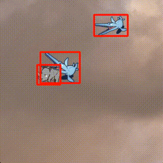

# YOLOv2による動物アイコン検出の訓練

参考記事:<a href="http://qiita.com/ashitani/items/566cf9234682cb5f2d60">YOLOv2でPPAP</a>

上のPPAPの記事では、darknetフレームワーク上でYOLOv2(tiny版)を訓練し、訓練結果をchainerでロードする手法について書かれていました。本記事では、ゼロからchainer上でモデルを訓練する手法について説明します。


## アイコン素材画像のダウンロード


以下のコマンドで、動物 & 恐竜のアイコン、および背景データを一式ダウンロードする。ダウンロードされた画像は`items/`および`backgrounds/`に保存される。

```
python download_images.py
```

なお、恐竜や動物のアイコン等は<a href="http://putiya.com/html/animal/animal00.html">こちら</a>、
各種背景画像は<a href="http://www.priga.jp/05.html">こちら</a>のフリー素材を使わせて頂きました。


## 動物データセットからランダム画像を生成してみる

今回は独自の画像生成用のスクリプトを使い、『素材画像』と『背景画像』を読み込んでランダムな合成画像を生成する。生成された合成画像は全てground truthとなるbounding boxの情報を持つ。

以下のコマンドで、画像生成スクリプトを使って各種動物画像と背景をランダムに合成した画像を表示する(訓練時にも同じ様に画像生成器を使ってbatchごとにランダムな教師データを生成する)。

```
python image_generate.py  
```





※生成された画像は、HSV色空間のランダム変換、ランダム回転、スケーリングを加えている。各パラメータは`image_generate.py`のコードを修正する事で調整できる。


## darknet19(画像識別器)の訓練
以下のコマンドでdarknet19のモデルの学習を行う。
YOLOv2では、事前学習としてdarknet19と呼ばれる独自の画像識別モデルを訓練する。
(YOLOv1ではVGGを使っていた)

※`setup.sh`は、必要なディレクトリを作成する初期化スクリプト。
学習が完了すると、`backup/darknet19_final.model`に重みパラメータを保存する。

```
./setup.sh
python darknet19_train.py
```


## darknet19のテスト
以下のコマンドで、学習済みのモデルを使って、指定した画像をカテゴリ分類を行う。
テストに使用する学習済み重みのファイル等、ハイパーパラメータを変更したい時は、`darknet19_predict.py`を書き換える。
デフォルトでは`backup/darknet19_final.model`の重みパラメータを読み込んでpredictionを行う。

```
python darknet19_predict.py items/Dog.png
```

## darknet19\_448の訓練
以下のコマンドで、darknet19の学習済みモデル(`backup/darknet19_final.model`)を初期値として読み込んで、darknet19_448の訓練を行う。darknet19_448は、darknet19の入力解像度を2倍にした画像識別モデル。一度darknet19で学習した後、解像度を2倍にしたdarknet19_448で学習するとネットワークがロバストになる。
※パスなどは必要に応じてコード内のハイパーパラメータを修正すれば良い。学習が完了すると、`backup/darknet19_448_final.model`に重みパラメータが保存される。

```
python darknet19_448_train.py
```

## darknet19\_448の重み切り出し

以下のコマンドで、darknet19_448の訓練済みモデルに対して、重みパラメータの切り出しを行う。
切り出す層を変えたい時は`partial_weights.py`のパラメータを修正する。
読み込む重みパラメータファイルはデフォルトで`backup/darknet19_448_final.model`になっている。書き出し先のファイルはデフォルトで`backup/partial.model`。

```
python partial_weights.py
```

## YOLOv2の訓練
以下のコマンドでYOLOv2を訓練する。
デフォルトでは`backup/partial.model`からweightsを重みの初期値として読み込む。学習が完了すると、`backup/yolov2_final.model`に重みパラメータが保存される。

```
python yolov2_train.py
```


## YOLOv2のテスト
以下のコマンドで、学習済みのモデルを使って、指定した画像内で物体検出を行う。

```
python yolov2_predict.py data/test.jpg 
```